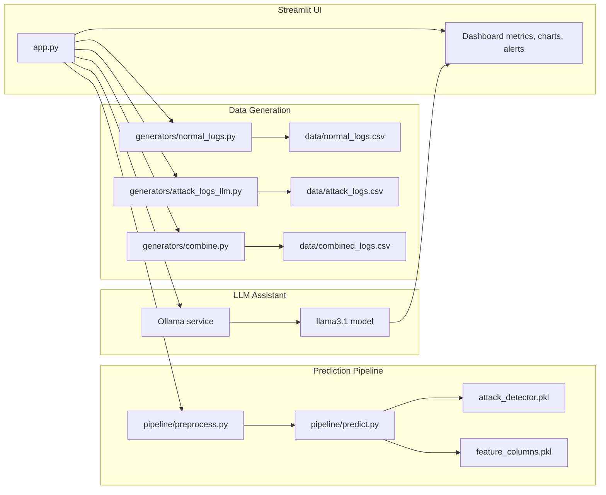
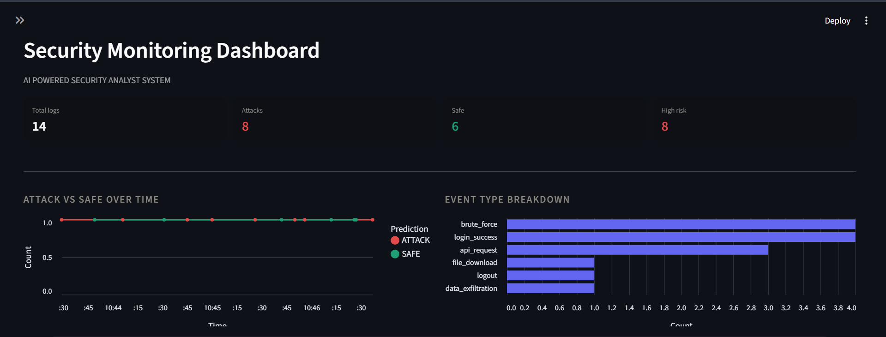
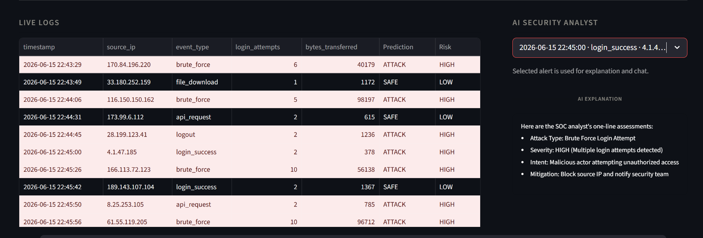
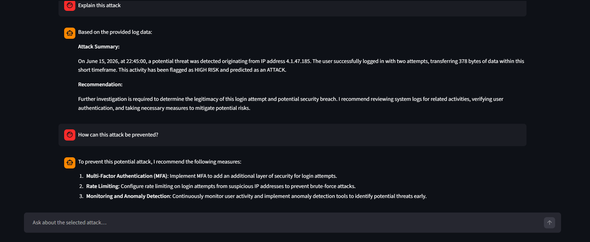

# AI Powered Security Monitoring System

A hands-on cybersecurity demo that combines synthetic security logs, a trained attack detector, and a live Streamlit dashboard to simulate how a small SOC-style monitoring system could work.

This project is not a production IDS. It is a realistic learning prototype built to show how an AI-assisted security workflow looks in practice: generate log events, classify them with a saved model, visualize the results, and ask an AI analyst questions about suspicious alerts.

## What makes this project interesting
- It generates both normal and attack-like activity in real time.
- It uses a saved machine learning model to classify events.
- It shows the outputs in a polished dashboard instead of just printing predictions in a notebook.
- It adds an LLM-powered analyst chat experience for explanation and investigation support.

---

## Project Overview

This project simulates a small security monitoring pipeline from start to finish:

1. Synthetic log events are generated with Python and Faker.
2. Attack-style logs can also be produced using Ollama + Llama 3.1 for more realistic examples.
3. The raw events are cleaned and converted into model-ready numeric features.
4. A saved classifier predicts whether each event looks like an attack.
5. The results are visualized in a Streamlit dashboard.
6. If an attack is detected, the user can ask an AI analyst chatbot to explain the event.

In short, this repository is a compact AI + security monitoring prototype that shows how a basic detection workflow can be turned into an interactive tool.

---

## What This Project Actually Contains

### Core features
- Synthetic normal log generation for everyday activity
- Attack-log generation for suspicious behavior patterns
- A combined dataset for model training or experimentation
- A preprocessing pipeline that converts raw logs into usable model input
- A saved classifier that returns attack predictions and risk output
- A live dashboard that presents alerts, trends, and explanations
- An LLM-powered analyst chatbot for selected attack events

### What the dashboard shows
- Total number of generated logs
- How many were flagged as attacks
- How many were marked safe
- How many were classified as high risk
- Time-based attack vs safe trends
- Event-type breakdowns
- A selected attack explanation panel
- An AI chat section for analyst-style question answering

---

## System Architecture




The project is split into three main parts:

### A. Data generation
The folder `generators/` contains scripts that create synthetic logs.

- `generators/normal_logs.py` generates normal activity logs
- `generators/attack_logs_llm.py` generates attack logs using Ollama (llama3.1)
- `generators/combine.py` combines normal and attack datasets into one training set

### B. Machine learning pipeline
The folder `pipeline/` contains the preprocessing and prediction logic.

- `pipeline/preprocess.py` converts timestamp, IP, and event-type data into model-friendly numeric features
- `pipeline/predict.py` loads the trained model and returns predictions and risk scores

### C. User interface
The file `app.py` launches the Streamlit dashboard.

It provides:
- Live log generation
- Real-time classification
- Visual summaries
- AI explanation for selected attacks
- Chat-based analysis using Ollama

### D. LLM chatbot feature
The dashboard also includes an AI analyst chat section.

When an attack is detected, the user can select that alert and ask the chatbot follow-up questions such as:
- Why is this event suspicious?
- What type of attack is this?
- What should I investigate first?
- How can I respond to this alert?

The chatbot is powered by Ollama using the `llama3.1` model. It uses the selected attack log as context and generates a brief, professional response. If the LLM is unavailable, the app falls back to a simple rule-based explanation so the dashboard still works.

---

## Project Structure

```text
Security System/
│
├── app.py                          # Streamlit dashboard
├── requirements.txt                # Python dependencies
├── data/                           # Generated CSV datasets
│   ├── attack_logs.csv
│   ├── normal_logs.csv
│   └── combined_logs.csv
├── generators/                     # Synthetic data generation scripts
│   ├── attack_logs_llm.py
│   ├── combine.py
│   └── normal_logs.py
├── pipeline/                       # Preprocessing and prediction logic
│   ├── preprocess.py
│   └── predict.py
└── model processing/               # Trained model artifacts
    ├── attack_detector.pkl
    ├── feature_columns.pkl
    └── preprocessing.ipynb
```

---

## Technologies Used

This project uses:
- Python
- Pandas
- Scikit-learn
- Faker
- Streamlit
- Ollama
- Joblib

The model is loaded from saved `.pkl` files in the `model processing/` folder.

---

## How the Detection Flow Works

The full flow is:

1. The dashboard generates a synthetic event.
2. The event includes fields such as:
   - timestamp
   - source_ip
   - event_type
   - login_attempts
   - bytes_transferred
3. The event is passed to the prediction pipeline.
4. The preprocessing step converts the raw event into numeric features.
5. The model predicts whether the event is an attack.
6. The dashboard displays the prediction, confidence, and risk level.

##### Example of a log input
```json
{
  "timestamp": "2026-06-15 10:14:32",
  "source_ip": "192.168.0.10",
  "event_type": "brute_force",
  "login_attempts": 9,
  "bytes_transferred": 70000
}
```

The model then decides whether this activity looks suspicious.

---

## Data Generation

#### Normal logs
Normal logs are generated using Faker and random values.
They simulate common user behavior such as:
- login_success
- file_download
- api_request
- logout

#### Attack logs
Attack logs are generated using either:
- a local fallback generator, or
- an LLM-based attack generator through Ollama.

Attack types include:
- brute_force
- port_scan
- data_exfiltration

This gives the system a realistic synthetic dataset for training and testing.

---

## Preprocessing Pipeline

Before prediction, the raw log is transformed in `pipeline/preprocess.py`:

- converts `timestamp` into `hour`, `day`, `month`, `weekday`
- creates one-hot encoded event type columns
- converts IP addresses into integer form using IPv4 parsing
- removes original text fields that the model does not accept directly

This is important because most classifiers work best with numeric features.

---

## Model Prediction

The prediction function in `pipeline/predict.py` does the following:

1. creates a DataFrame from the input log,
2. applies preprocessing,
3. ensures all expected model columns exist,
4. feeds the features to the saved model,
5. returns:
   - prediction label,
   - confidence score,
   - risk level.

The returned output looks like this:

```json
{
  "Prediction": "ATTACK",
  "Confidence": 0.93,
  "Risk": "HIGH"
}
```

---

## LLM Chatbot and AI Analyst Mode

The dashboard includes a built-in AI analyst chat experience.

### How it works
1. The system detects an attack in the live stream.
2. The user selects that alert from the dashboard.
3. The selected log is passed as context to the LLM.
4. The chatbot answers questions about the event in a short SOC-style response.

### What it is used for
- Explaining attack behavior,
- Helping users understand why an alert was flagged,
- Providing quick investigation guidance,
- Simulating an AI assistant for security analysis.

### Important note
The chatbot is optional. If you enable the LLM mode in the dashboard, the app uses Ollama for AI explanations and chatting. If Ollama is not available or the model fails, the system uses a fallback explanation to keep the UI functional.

---

## Running the App

#### Prerequisites
Make sure you have:
- Python 3.10+
- pip
- Ollama installed and running locally

#### 1. Install Ollama
Install Ollama from the official website and start the service on your machine.

For example, on most systems you can start the Ollama server with:
```bash
ollama serve
```

If you want the LLM-powered attack generation and chatbot responses to work properly, make sure the model `llama3.1` is available.

You can pull it with:
```bash
ollama pull llama3.1
```

#### 2. Create and activate a virtual environment
```bash
python -m venv venv
```

On Windows:
```bash
venv\Scripts\activate
```

On macOS/Linux:
```bash
source venv/bin/activate
```

#### 3. Install Python dependencies
```bash
pip install -r requirements.txt
```

#### 4. Start the dashboard
```bash
streamlit run app.py
```

#### 5. Generate fresh datasets (optional, if you want to rebuild the sample data)
```bash
python generators/normal_logs.py
python generators/attack_logs_llm.py
python generators/combine.py
```

---

## Demo Images








---

## Conclusion

This project is a compact, beginner-friendly example of how AI and cybersecurity can work together in a real monitoring workflow.

It combines:
- data generation,
- model inference,
- preprocessing,
- visual analytics,
- and an interactive security dashboard.


---


